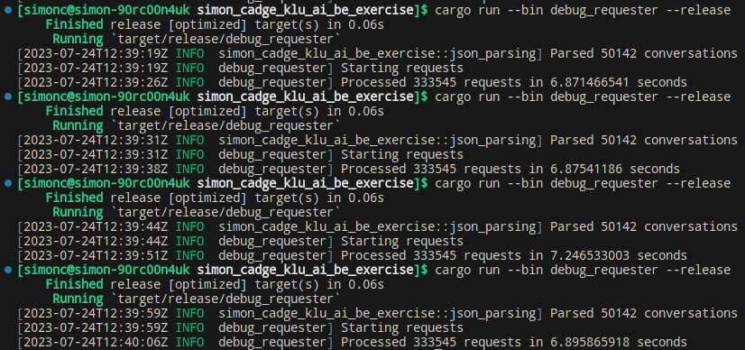
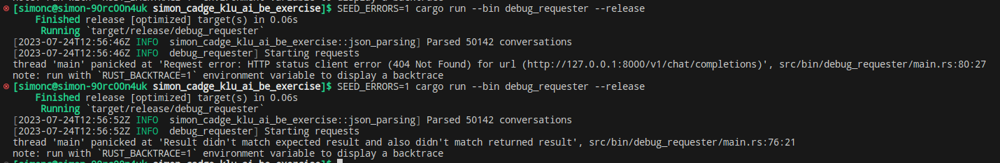

# Mock Chat Completions API
Simon Cadge's submission for the Klu Backend Exercise. A simple web server which mimics the openai Chat Completions API, using the dataset found [here](https://huggingface.co/datasets/anon8231489123/ShareGPT_Vicuna_unfiltered/blob/main/ShareGPT_V3_unfiltered_cleaned_split.json).  
**Since the dataset is large it isn't included in this Git repository. When running the program yourself you must first download the dataset and put it into a folder called 'data' in the root of the project.**  
The project is written in Rust, with two separate binaries. 
- 'server', which runs the webserver.
- 'debug_requester', which makes asynchronous requests for every possible valid Assistant message in the dataset, checks the responses for validity and benchmarks performance.

## Installation/Usage
Since the project is written in Rust you will need to have rust installed: [rustup](https://rustup.rs/)  
Clone the project, cd into the project folder.  
### To build the binaries:  
debug | `cargo build`  
release | `cargo build --release`  
### To run the binaries:  
debug | `cargo run --bin server` / `cargo run --bin debug_requester`  
release | `cargo run --bin server --release` / `cargo run --bin debug_requester --release`  
As you aren't debugging the program, running the release version should be sufficient. The debug version logs more, but it runs significantly slower.
### Usage:  
The server listens on http://127.0.0.1:8000, and it only configures a single route http://127.0.0.1:8000/v1/chat/completions.  
That route only accepts post requests. The post body must contain JSON which is formatted according to the openai Chat Completions API defined [here](https://platform.openai.com/docs/API-reference/chat).  
(Note: For this program, the only required field is the `messages` array, which only cares about `role` and `content`. Any other fields will be ignored.)  
Example request body:  
```
{
  "model": "gpt-3.5-turbo",
  "messages": [
    {
      "role": "user",
      "content": "Please write a firm yet humurous and lighthearted note requesting that people RSVP whether they are coming to the purim seudah. Please incorporate wordplay and references to megillat esther."
    },
    {
      "role": "assistant",
      "content": "Sure, here's a lighthearted note incorporating wordplay and a reference to Megillat Esther:\n\nGreetings friends and family,\n\nAs we approach the joyous holiday of Purim, we're preparing for our own festive celebration - a Purim Seudah fit for a king (or queen, like Esther herself!).\n\nTo make sure we have enough food and drink for everyone, we kindly request that you let us know if you'll be attending. Don't leave us hanging like Haman from the gallows! We need to know whether to set a place at the table for you or not.\n\nSo please, take a moment to RSVP and let us know whether you'll be joining us for this merriment-filled occasion. We promise there will be plenty of hamantaschen to go around (and no, we won't be hiding any decrees to wipe out the Jews in them).\n\nWe look forward to seeing you soon and celebrating the miraculous salvation of our people together.\n\nP.S. If you're still on the fence about coming, just remember - Purim is the only time of year when it's perfectly acceptable to get a little wild and crazy, so come dressed up in your best costumes and let's have some fun!"
    },
    {
      "role": "user",
      "content": "Write a menu for the purim seudah which doesnt include any dairy foods and each food name has a play on a purim-related item"
    }
  ]
}
```  
This request demonstrates a conversation which is already a few messages in. This request will succeed and return the following response:  
```
{
  "id": "dcTB2RK",
  "created": 1690198033,
  "message": {
    "role": "Assistant",
    "content": "Sure, here's a Purim Seudah menu with wordplay and no dairy items:\n\n1. \"Megillah\" Meatballs - juicy meatballs served in a savory sauce\n2. \"Hamantaschen\" Chicken - tender and flavorful chicken, seasoned to perfection\n3. \"Esther's Crown\" Roast Beef - succulent roast beef, served with horseradish for an added kick\n4. \"Purim Pockets\" Potatoes - crispy roasted potatoes, seasoned with garlic and herbs\n5. \"Mordechai's Mishloach Manot\" Mixed Vegetables - a colorful medley of veggies, roasted to perfection\n6. \"Ahashverosh's Feast\" Fruit Platter - a selection of fresh and juicy fruits, including grapes, berries, and tropical delights\n7. \"Grogger\" Grape Juice - sweet and refreshing grape juice, served in honor of the noisemakers we use to drown out Haman's name\n\nEnjoy your Purim Seudah and may the joy of the holiday fill your heart and home!"
  }
}
```  
The id 'dcTB2RK' corresponds to the conversation id in the JSON dataset, while the created timestamp is a unix timestamp generated at the time the request was handled.  
If a single character of any of the messages in the request is incorrect, however, the request will return a 404 error.  
`No valid response exists for the given request`  

## Approach/Decisions
There are two main decisions I made during the writing of this program. The first was choosing to use Rust, and the second was the optimisations afforded by my HashMap based data structure.  
### Rust
In my opinion Rust was a clear choice for this project, as it makes writing incredibly performant code easy. The ecosystem is mature enough that there are good projects with good adoption and documentation for each of my main requirements:
- Web Server - [Rocket](https://rocket.rs/)
- Serialisation/Deserialisation - [Serde](https://serde.rs/)
- Parallel execution - [Tokio](https://tokio.rs/)

Since performance was a concern, and specifically throughput of requests per minute, I wanted to use a language that I knew wouldn't hide any bottlenecks that I would need to hunt for. With Rust everything is under your control, and since I had a pretty good idea of how I would optimise this rather simple problem I knew that I could achieve exactly what I wanted to in Rust.  
Admittedly Rust is more effort upfront than say Python, and without rewriting this in Python I can't say for sure that Rust was definitely faster, I expect most of the speed of the solution actually comes from the use of a preprocessed HashMap than any snazzy Rust features. That being said, I really enjoy writing Rust code, whenever I write something in Rust I feel like I come away smarter, so with this project being well suited to it there is no way I was going to use anything else. If we were using something like this in the company I would be keen to discuss and come to a general consensus about what language to use before starting programming in earnest.
### Preprocessed Hashed Responses
This is the main actual optimisation. The dataset we're given contains every request and response that we can handle, and so when it comes to optimising for performance we want to optimise the search function as much as possible. This is a classic coding interview problem with a classic coding interview solution, a HashMap!  
Before the server starts listening for requests, the parsed Conversations are preprocessed into a HashMap which includes every valid Assistant response which might be requested. The key for each Assistant response is the list of messages that preceeded the response, combined into a single string. As such, when the server receives a request all it needs to do is build the key by concatenating the messages in the messages array into one string, and then get the message from the HashMap which aligns with that key.  
A HashMap has O(1) search complexity, which means that no matter how big the dataset of things that need to be searched through, searching will always take the same amount of time. That amount of time is bounded only by the complexity of the hashing algorithm.  As such, it doesn't matter what the user requests, the server will always perform an O(1) complexity search and then return the correct response incredibly quickly.  
The two main downsides of using a HashMap are the memory footprint and the requirement to calculate a unique key for each value.  
The memory footprint isn't an issue for us. In the modern day memory and storage are incredibly cheap and sacrificing memory for performance is a common technique.  
The requirement of a unique key is also not an issue, since according to the openai Chat Completions API the user must provide the history of messages in a conversation when requesting the next message, and so we know that every request to the API will contain the information we need to create a unique key. The one exception to this are those scenarios where different conversations sometimes start with the exact same User message (e.g. 'hi'), so in this case our HashedResponse struct will randomly select one of the multilple valid responses to return.

## Testing & Benchmarking
### Benchmarking
With the preprocessed HashMap being so quick, I have had a surprisingly difficult time deciding how to benchmark the server since any logging or tracing I implemented would itself become the bottleneck. I tried logging the start and end time of each request in a log file and then calculating throughput from that, but even when writing to a buffered file the time to run through all of the requests more than trippled with logging turned on, and so clearly the logs wouldn't be an accurate reflection of the performance.  
What's more, running a local client against a local server clearly doesn't capture many of the complexities and latencies that would be present in any normal execution of a web server. And my pre processed HashMap already doesn't really reflect what an actual AI processing requests would look like since here we have the answers ready formed.  
With all of these things in mind, I decided that the best way to test the system would be by writing a second program (debug_requester), which also parses the JSON dataset and then makes a call to the server for every valid Request that exists in the dataset, comparing the returned message with the expected value. The debug_requester fails on any error, whether that be a connection error, a 404 not found error or a failed assertion, and assuming that it completes successfully it will log the total number of requests that were completed and the elapsed time.  
The debug_requester makes use of the Tokio async framework to submit as many requests as possible asynchronously, bounded by the number of CPU threads supported on the system.  
By not calculating elapsed time for each individual request we avoid the overhead of doing such complex calculations thousands of times. We do lose granularity when it comes to upper/lower bounds and each individual request, but as I said earlier the added bottleneck that profiling introduces would make this irrelevant anyway. Accepting that the network latency on a single machine is minimal, the total time calculated includes not just the time that the server spends completing a request but also the networking time, and the time spent by the debug_requester program dealing with the complexity of orchestrating and managing many asynchronous tasks.
#### Results
  
As seen above, when I run the release debug_requester against the release server I tend to get a total time to process 333,545 requests of around 6.9 seconds. There was one instance where it instead took 7.25 seconds, which could have been caused by any number of external factors like background processes temporarily using more processing power than usual.  
Taking 7 seconds as the general average, 333,545 requests in 7 seconds makes for 47,649 requests completed every second, or about 48 per millisecond. Not bad.
### Testing
The debug_requester program uses the same parsing logic for the JSON dataset as the main server program, and it then uses some quite complex asynchronous code to make all of the requests to the server, so to ensure that I wasn't just swallowing errors and failing to test properly I decided to add in the functionality to seed some errors in the data set when initially parsing it.  
If you run either the server or the debugger with the environment variable SEED_ERRORS set, the parsing logic will then use rng to select 1% of all messages parsed and modify them in small ways which should cause them to fail equality checks.  
If I now run the debugger with this flag set we will see the two possible types of errors this can cause:  
  
The first execution fails due to a 404 not found error. This is caused when the error was introduced to part of one of the messages which make up a ChatCompletionsRequest, and so when the server receives the request it doesn't find a value in the HashMap associated with that key, and therefore returns a 404 not found error.  
The second execution fails due to an assertion error, where the error was introduced to an Assistant message. When the debug program requested this message from the server it received the correct form of that message but the debug program compared it with the incorrect version found locally and determined that they do not match.  
Since we can see that errors are correctly caught and exposed when they happen, we can be confident that the normal execution of both the server and debug_requester programs is performing correctly.